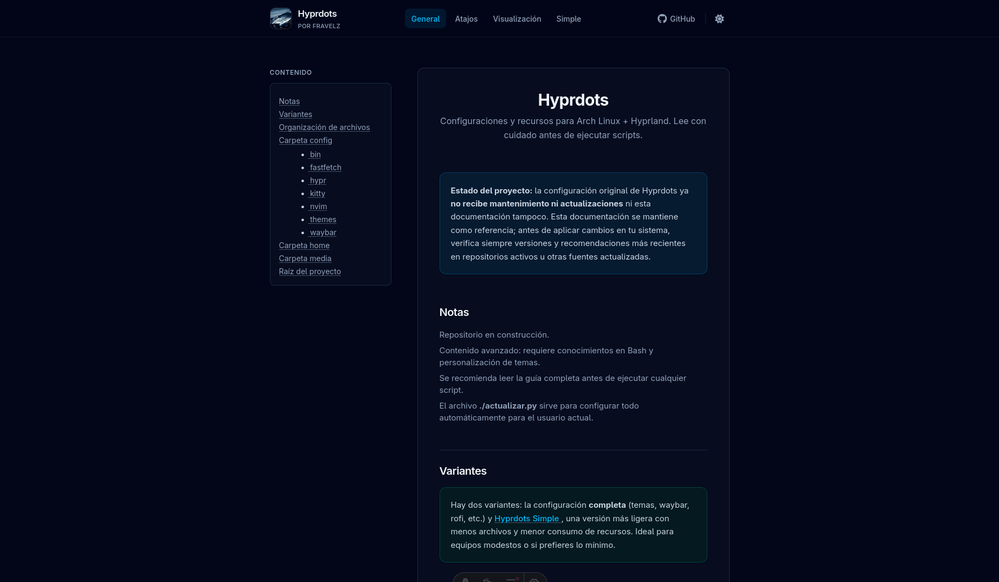

# Web Hyprdots

[Version en Español](./README.md)



Documentation site for **Hyprdots**: configurations and resources for Arch Linux + Hyprland. Includes a general guide, keyboard shortcuts, theme preview, and the **Hyprdots Simple** variant.

> ⚠️ **Warning:** The original Hyprdots configuration is no longer **maintained or updated**. This website is maintained for historical reference only. Always consult the official documentation or the latest repositories before applying scripts or copying configurations to production systems.

## Stack

- **[Astro](https://astro.build)** — Static site with `.astro` components
- **[React](https://react.dev)** — Only where interactivity is needed (code blocks with copy and highlighting)
- **[Tailwind CSS](https://tailwindcss.com)** v4 — Styles and light/dark mode
- **pnpm** — Package manager

## Structure

(Approximation)


``` text
src/
├── components/
│ ├── atoms/ # Link, Image, Line, Text
│ ├── molecules/ # List, Table, Title, Code (React)
│ ├── organisms/ # Structure, Complete Syllabus, Complete Syllabus
│ └── sections/ # General, Shortcuts, Visualization, Simple
├── layouts/
│ └── BaseLayout.astro
├── pages/
│ ├── index.astro # /
│ ├── shortcuts/index.astro # /shortcuts/
│ ├── simple/index.astro # /simple/
│ └── visualization/index.astro # /visualization/
└── styles/
└── global.css
```

## Commands

| Command | Description |

| -------------- | ---------------------- |

`pnpm install` | Install dependencies |

`pnpm dev` | Development server |

`pnpm build` | Build static site |

`pnpm preview` | Preview build |

`pnpm lint` | Run ESLint |

## Deployment

The workflow in `.github/workflows/deploy.yml` compiles the project with `pnpm build` and publishes the contents of `dist/` (to GitHub Pages).

## Information

**License:** MIT

**Author:** Fravelz
